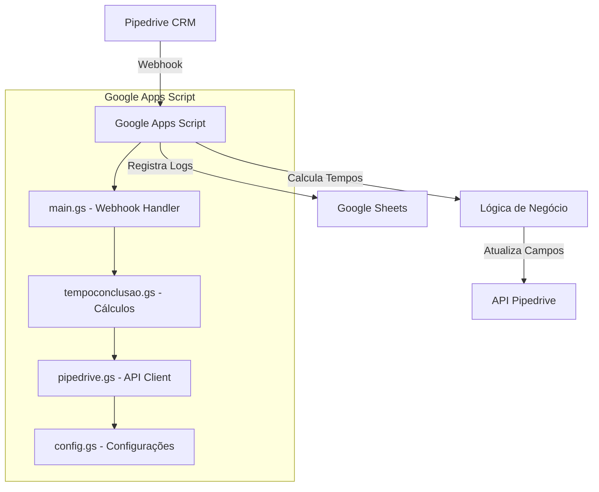

# 🏗️ Arquitetura do Sistema

## 📊 Visão Geral



## 📁 Componentes

### 🔧 main.gs
**Responsabilidade**: Ponto de entrada principal para webhooks

**Principais Funções**:
- `doPost(e)`: Processa eventos do webhook
- Validação de dados de entrada
- Sistema de cache para evitar duplicação
- Tratamento de erros global

**Fluxo**:
1. Recebe evento do Pipedrive
2. Valida formato JSON
3. Verifica se é evento de deal
4. Implementa cache para evitar processamento duplicado
5. Chama `calculaTempoDeConclusao()`
6. Retorna resposta JSON

### ⚡ tempoconclusao.gs
**Responsabilidade**: Lógica de cálculo dos tempos

**Principais Funções**:
- `calculaTempoDeConclusao()`: Função principal de cálculo
- `setOngoing()`: Calcula tempo entre duas datas
- `setCancelamento()`: Cálculo específico para cancelamento

**Lógica de Negócio**:
- **Triagem**: Data Preenchimento → Término Triagem
- **ITBI**: Término Triagem → Término ITBI
- **Contratos**: Término Triagem → Término Contrato
- **Registro**: Data Início Registro → Término Registro
- **Cancelamento**: Data Início Cancelamento → Término Cancelamento

### 🌐 pipedrive.gs
**Responsabilidade**: Comunicação com API do Pipedrive

**Principais Funções**:
- `callPipedrive()`: Cliente HTTP para API
- `getOldObject()`: Conversão de formato webhook 2.0 → 1.0
- `rateLimit_()`: Controle de taxa de requisições

**Características**:
- Rate limiting de ~400ms entre chamadas
- Tratamento de erros HTTP
- Serialização de chamadas via LockService
- Conversão automática de objetos de campo

### ⚙️ config.gs
**Responsabilidade**: Configurações e utilitários

**Principais Funções**:
- `setToken()`: Configuração do token Pipedrive
- `appendLog_()`: Registro de logs na planilha
- `logError()`: Tratamento de erros
- `getSheet_()`: Gestão da planilha de logs

## 🔄 Fluxo de Dados

### 1. Recebimento do Webhook
```
Pipedrive → POST /webhook → doPost()
```

### 2. Processamento do Evento
```
doPost() → Validação → Cache Check → calculaTempoDeConclusao()
```

### 3. Cálculo dos Tempos
```
calculaTempoDeConclusao() → setOngoing() → Cálculo de Dias
```

### 4. Atualização no Pipedrive
```
Patch Object → callPipedrive() → Rate Limit → API Request
```

### 5. Registro de Logs
```
appendLog_() → Google Sheets → Audit Trail
```

## 🔒 Segurança e Controle

### Rate Limiting
- **Implementação**: LockService + Properties
- **Intervalo**: 400ms entre requisições
- **Objetivo**: Evitar limits da API Pipedrive

### Cache de Processamento
- **Chave**: `lock_deal_{id}_{timestamp}`
- **Duração**: 60 segundos
- **Objetivo**: Evitar processamento duplicado

### Gestão de Tokens
- **Armazenamento**: Properties do Google Apps Script
- **Método**: `PropertiesService.getScriptProperties()`
- **Segurança**: Não exposto em logs

### Tratamento de Erros
- **Logs Estruturados**: Planilha dedicada para erros
- **Stack Traces**: Preservação completa para debug
- **Graceful Degradation**: Sistema continua funcionando mesmo com erros parciais

## 📈 Performance e Escalabilidade

### Otimizações Implementadas
1. **Cache de Processamento**: Evita webhooks duplicados
2. **Rate Limiting**: Previne throttling da API
3. **Validação Prévia**: Filtra eventos não relevantes
4. **Batch Updates**: Agrupa mudanças em uma única chamada API

### Limitações
- **Timeout**: Google Apps Script tem limite de 6 minutos
- **Memoria**: Limitado a objetos até ~50MB
- **Concorrência**: LockService serializa execuções

### Monitoramento
- **Logs Operacionais**: Todas as operações são logadas
- **Métricas de Erro**: Taxa de falhas por período
- **Performance**: Tempo de processamento por deal

## 🔧 Configuração de Campos

### Mapeamento de IDs
Todos os campos são mapeados via constantes para facilitar manutenção:

```javascript
const F = {
  Tempo_Conclusao_Triagem: 'id_campo_pipedrive',
  // ... outros campos
};

const TERMINO_ID = {
  TRIAGEM: 'id_campo_termino_triagem',
  // ... outros campos
};
```

### Flexibilidade
- IDs centralizados em constantes
- Fácil mapeamento de novos campos
- Labels legíveis para logs

## 🧪 Estratégia de Testes

### Testes Manuais
1. **Webhook Simulation**: Dados simulados via `doPost()`
2. **API Testing**: Chamadas diretas via `callPipedrive()`
3. **Calculation Testing**: Execução isolada de `calculaTempoDeConclusao()`

### Ambientes
- **Desenvolvimento**: Script separado para testes
- **Produção**: Versão estável implantada
- **Logs**: Planilhas separadas por ambiente

### Validação
- **Data Quality**: Validação de datas e tipos
- **Business Rules**: Verificação de regras de negócio
- **Error Handling**: Testes de cenários de erro